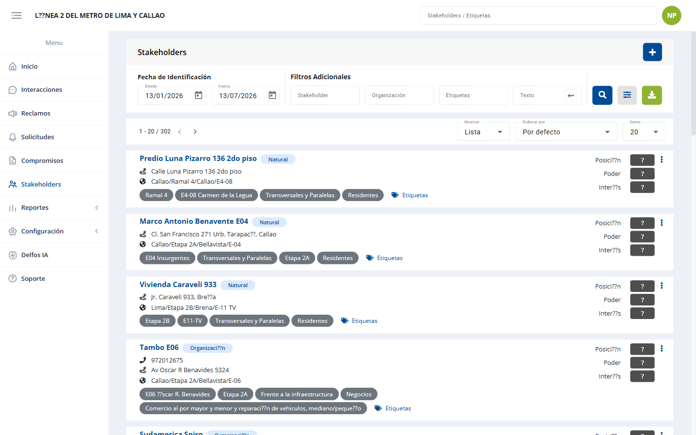
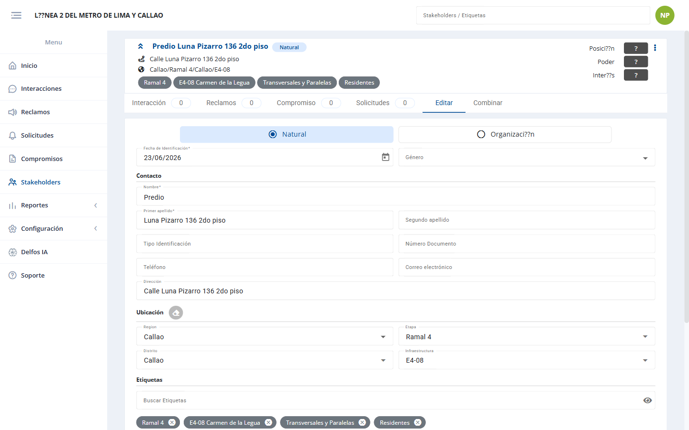
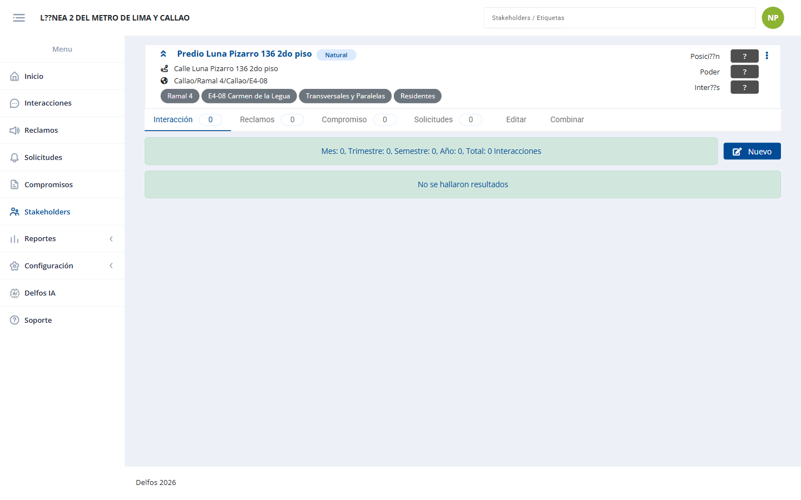
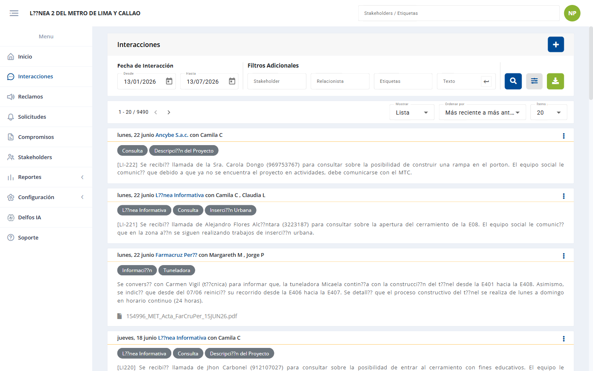
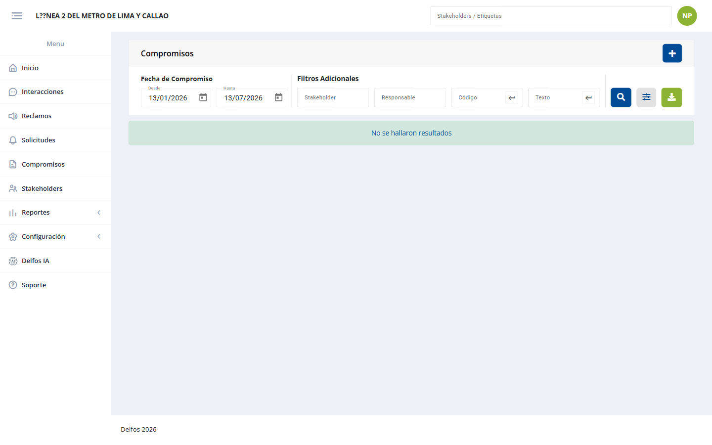
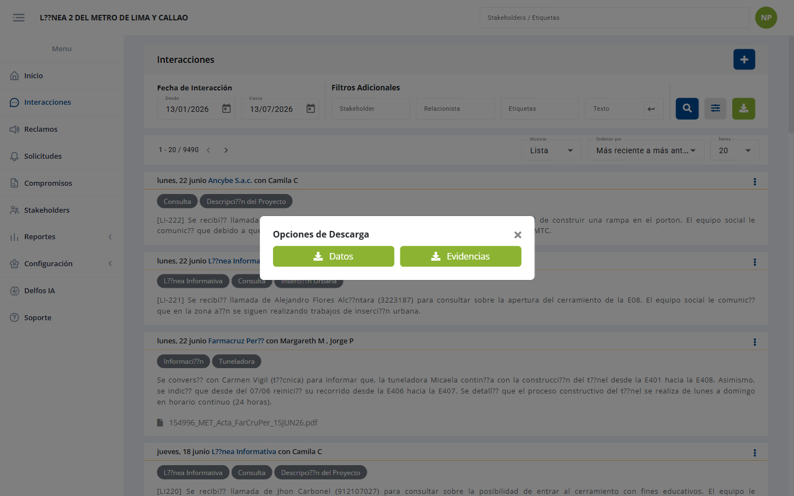

# Documentación Funcional del Sistema Delfos

> **Propósito.** Este documento describe toda la funcionalidad del backend de Delfos tal como la exponen sus controladores (endpoints de la API), cruzada con los servicios que implementan la lógica de negocio y con capturas reales de las pantallas que consumen esos endpoints.
>
> **Fuente.** Mapa de rutas real (`php artisan route:list`) cruzado con los controladores de `app/Http/Controllers/` y los servicios de `app/Services/`, más un recorrido en vivo de la aplicación.
>
> **Alcance.** 82 controladores enrutados · 544 endpoints · 168 servicios.
> **Backend.** Laravel 11 / PHP 8.2 (`delfos-backend-laravel`). **Frontend.** Angular 19 (`delfos-frontend`).
> **Proyecto de referencia (capturas).** "Línea 2 del Metro de Lima y Callao" (`metro2`), rol Administrador.
> **Fecha.** 13/07/2026.

---

## 1. Cómo leer este documento

Cada módulo se documenta con una tabla de endpoints:

| Columna | Significado |
|---|---|
| **Método** | Verbo HTTP: `GET` (consultar), `POST` (crear/editar/acciones), `DELETE` (eliminar). |
| **Ruta** | Path relativo a la base de la API. Los `{parámetro}` son valores en la URL (p. ej. `{idsh}` = id del stakeholder). |
| **Acción** | Método del controlador que atiende la ruta. |
| **Descripción** | Qué hace de cara al usuario. |

Y, cuando aporta, con un bloque **Servicios** que indica qué clases de `app/Services/` implementan la lógica.

### 1.1 Convenciones de nombres (patrones que se repiten en todo el sistema)

Entender estos sufijos permite leer cualquier módulo sin explicación adicional:

| Patrón | Qué hace |
|---|---|
| `.../listar` | Lista **paginada y filtrable** de registros. |
| `.../listar-init` | Datos iniciales de la pantalla de listado (catálogos, filtros, opciones de dropdown). |
| `.../listar-mapa` | Igual que `listar`, pero preparado para la vista de **mapa** (incluye geometría/coordenadas). |
| `.../ver/{id}` | **Detalle** completo de un registro. |
| `.../crear` | **Crea** un registro nuevo. |
| `.../crear-init` | Datos iniciales del **formulario de creación** (catálogos, valores por defecto). |
| `.../editar` | **Actualiza** un registro existente. |
| `.../eliminar/{id}` | **Elimina** un registro (baja lógica). |
| `.../reordenar` | Cambia el **orden** de los ítems de un catálogo (drag & drop). |
| `.../exportar` | Exporta a archivo (Excel/PDF) de forma **síncrona**. |
| `.../exportar/iniciar` + `.../exportar/{exportId}/status` + `.../exportar/{exportId}/download` | Exportación **asíncrona** (volúmenes grandes): se inicia un trabajo, se consulta su estado y se descarga al terminar. |
| `.../archivo-exportar` | Exporta los **archivos adjuntos** (evidencias) del módulo. |
| `.../proceso/{id}` | **Línea de tiempo / historial** de un registro (trazabilidad de estados). |
| `.../informe` | Genera un **informe** imprimible/consolidado (PDF). |
| `.../qc` | Marca de **control de calidad** (Quality Check) sobre un registro. |
| `.../ficha/{id}` | **Ficha** (hoja de resumen 360°) de una entidad. |
| `dropdown/...` | Devuelve listas ligeras para **selectores** de formularios. |

### 1.2 Seguridad y contexto (transversal a todos los módulos)

- **Autenticación.** Salvo el bloque de acceso (`/auth/init`, `/auth/login`, `/auth/oauth`, `/recover*`, `/oauth/url`), **todos los endpoints exigen JWT**, transportado en cookie HttpOnly `token_delfos`. Cadena de middlewares por petición: `jwt` (valida el token) → `profile-permit` (comprueba que el rol tenga permiso sobre el endpoint) → `accion-log` (registra la acción para auditoría).
- **Middlewares globales.** `SecureHeaders` (cabeceras de seguridad + CSP), `MaintenanceMiddleware` (modo mantenimiento) y `VerifyCsrfOrigin` (valida `Origin`/`Referer` contra la allowlist de CORS en peticiones que cambian estado).
- **Multi-tenant.** Cada proyecto es una **base de datos independiente**; la conexión se resuelve a partir del proyecto contenido en el JWT. Un usuario sólo ve y toca datos de su propio proyecto.
- **Autorización por registro.** En interacciones, reclamos, solicitudes y compromisos, un usuario de rol básico sólo puede **editar/eliminar lo que él creó** (o donde es relacionista asignado); administradores y supervisores no tienen esa restricción. La **lectura** dentro del proyecto es abierta (regla de negocio: "ver todo el proyecto, editar sólo lo propio"). En **stakeholders** el CRUD es compartido.
- **Rate limiting.** `login`, `oauth`, `recover` y `recover/password` tienen límites de peticiones por IP/usuario. El login añade reCAPTCHA y bloqueo temporal con backoff tras intentos fallidos.
- **Módulos activables.** Un proyecto puede tener módulos apagados (`setup/general/modulo/editar`). En el proyecto de referencia `metro2`, **Predios** y **Delfos IA** están deshabilitados: sus rutas de frontend redirigen a Inicio aunque los endpoints existan en la API.

---

## 2. Mapa de módulos

| # | Área funcional | Módulos incluidos |
|---|---|---|
| 3 | **Acceso y cuenta** | Autenticación, Recuperación de contraseña, OAuth, Perfil, Notificaciones, Sesiones |
| 4 | **Boletín** | Avisos/novedades al entrar |
| 5 | **Stakeholders** | Gestión, ficha 360°, evaluación, importación, relacionistas |
| 6 | **Predios** | Predios, códigos, stakeholders del predio |
| 7 | **Interacciones** | Interacciones y comentarios |
| 8 | **Reclamos** | Reclamo y su ciclo (evaluación → propuesta → respuesta → apelación → cierre) |
| 9 | **Solicitudes** | Solicitud y su ciclo (evaluación → propuesta → revisión → aprobación → cierre) |
| 10 | **Compromisos** | Compromiso, entregables y etapas del entregable |
| 11 | **Compromisos externos** | Compromisox y sus etapas |
| 12 | **Mapa (GIS)** | Mapa base, capas y dibujo |
| 13 | **Delfos IA** | Asistente conversacional |
| 14 | **Reportes y Dashboards** | 10 dashboards analíticos + Power BI |
| 15 | **Generador de archivos** | Exportaciones pesadas |
| 16 | **Generales y selectores** | Dropdowns y datos del proyecto |
| 17 | **Configuración (Setup)** | General, usuarios, tags, ubigeo, mapa, módulos, prompts IA, evaluación, catálogos |
| 18 | **Soporte** | Reporte de incidencias (Bug) |

---

## 3. Acceso y cuenta

*Figura 1. Pantalla de acceso (`/auth/login/{proyecto}`). Se ingresa con usuario y contraseña; también hay acceso con Outlook y Google. El enlace inferior lleva a la recuperación de contraseña. La página está protegida por reCAPTCHA.*

### 3.1 Autenticación — `AuthController`

| Método | Ruta | Acción | Descripción |
|---|---|---|---|
| GET | `/auth/init` | `init` | Datos iniciales de la pantalla de login (nombre y logo del proyecto, proveedores OAuth habilitados). Público. |
| POST | `/auth/login` | `login` | Inicia sesión con usuario/contraseña. Valida reCAPTCHA, aplica bloqueo temporal por intentos fallidos, registra bitácora y emite el JWT en cookie HttpOnly. |
| POST | `/auth/oauth` | `oauth` | Inicia sesión con un proveedor externo (Google/Outlook) a partir del código de reclamo devuelto por el proveedor. |
| GET | `/auth/me` | `me` | Devuelve los datos del usuario autenticado; permite restaurar la sesión desde la cookie al recargar el navegador. |

**Servicios.** `Auth\AuthService` (validación de proyecto, verificación de credenciales, bitácora, bloqueo), `Auth\LoginLockout` (bloqueo temporal con backoff), `Oauth\GoogleOauthService` / `Oauth\OutlookOauthService`, `General\MailerService` (aviso de inicio de sesión nuevo). Helpers: `DelfosEncryption` (firma del JWT), `JwtCookie` (emisión de la cookie).

### 3.2 Recuperación de contraseña — `RecoverController`

| Método | Ruta | Acción | Descripción |
|---|---|---|---|
| POST | `/recover` | `solicitar` | Solicita el restablecimiento: valida reCAPTCHA, genera un token de un solo uso y envía el correo con el enlace. |
| POST | `/recover/password` | `passwordCambiar` | Fija la nueva contraseña validando el token (un solo uso, con caducidad). |

**Servicios.** `Auth\RecoverService`, `General\MailerService`.

### 3.3 Conexiones OAuth (calendario/correo) — `OauthController`

| Método | Ruta | Acción | Descripción |
|---|---|---|---|
| GET | `/oauth/url` | `servicioUrl` | Devuelve la URL de autorización del proveedor para iniciar la conexión. |
| POST | `/oauth/conectar` | `servicioConectar` | Completa la conexión de la cuenta externa (Google/Outlook) con el usuario Delfos. |
| DELETE | `/oauth/desconectar/{idconexion}` | `servicioDesconectar` | Desvincula la cuenta externa. |

**Servicios.** `Oauth\OauthService`, `Oauth\OauthUsuarioService`, `Oauth\Google\GoogleOauthService`, `Oauth\Outlook\OutlookOauthService`.

### 3.4 Perfil — `PerfilController`

| Método | Ruta | Acción | Descripción |
|---|---|---|---|
| GET | `/perfil` | `init` | Datos del perfil del usuario en sesión. |
| GET | `/perfil/formulario-init` | `formularioInit` | Catálogos para el formulario de edición del perfil. |
| POST | `/perfil/actualizar` | `actualizar` | Actualiza los datos personales del usuario. |
| POST | `/perfil/password-editar` | `passwordEditar` | Cambia la contraseña propia. |
| POST | `/perfil/logout` | `logout` | Cierra la sesión actual (invalida la cookie). |
| POST | `/perfil/logout-all` | `logoutTodos` | Cierra **todas** las sesiones abiertas del usuario en cualquier dispositivo. |

**Servicios.** `Perfil\PerfilService`, `Oauth\OauthUsuarioService`, `Setup\General\SetupGeneralService`.

### 3.5 Notificaciones del perfil — `PerfilNotificacionController`

| Método | Ruta | Acción | Descripción |
|---|---|---|---|
| GET | `/perfil/notificaciones/init` | `init` | Preferencias de notificación del usuario (qué avisos por correo desea recibir). |
| POST | `/perfil/notificaciones/editar` | `editar` | Guarda esas preferencias. |

**Servicios.** `Perfil\PerfilNotificacionService`.

### 3.6 Sesiones activas — `PerfilSesionController`

| Método | Ruta | Acción | Descripción |
|---|---|---|---|
| GET | `/perfil/sesion/listar` | `sesionListar` | Lista los inicios de sesión del usuario (dispositivo, fecha, IP) para que detecte accesos no reconocidos. |

**Servicios.** `Perfil\PerfilSesionService`.

---

## 4. Boletín — `BoletinController`

Avisos que el sistema muestra al usuario al ingresar (novedades de versión, comunicados).

| Método | Ruta | Acción | Descripción |
|---|---|---|---|
| GET | `/boletin/init` | `boletinInit` | Devuelve el boletín pendiente de ver, si lo hay. |
| POST | `/boletin/visto` | `boletinVisto` | Marca el boletín como leído para no volver a mostrarlo. |

**Servicios.** `Boletin\BoletinService`. Los adjuntos se sirven desde S3.

---

## 5. Stakeholders

El **Stakeholder** (grupo de interés) es la entidad central de Delfos: a él se asocian interacciones, reclamos, solicitudes y compromisos.

*Figura 2. Listado de stakeholders (`/pages/gestion/stakeholder`). Arriba los filtros; al centro los resultados paginados; a la derecha los botones de buscar, filtros adicionales y descarga.*

*Figura 3. Ficha 360° de un stakeholder: reúne sus datos, su evaluación y todo su historial de gestión.*

*Figura 4. La ficha se abre por pestañas (`?tab=1`): Interacciones, Reclamos, Solicitudes, Compromisos, Editar y Combinar.*

### 5.1 Gestión de stakeholders — `StakeholderController` (21 endpoints)

| Método | Ruta | Acción | Descripción |
|---|---|---|---|
| GET | `/stakeholder/listar` | `stakeholderListar` | Lista paginada y filtrable del directorio de stakeholders. |
| GET | `/stakeholder/listar-init` | `stakeholderListarInit` | Catálogos y filtros de la pantalla de listado. |
| GET | `/stakeholder/listar-mapa` | `stakeholderListar` | Igual que `listar` pero con geometría, para pintarlos en el mapa. |
| GET | `/stakeholder/ver/{idsh}` | `stakeholderVer` | Detalle de un stakeholder. |
| GET | `/stakeholder/ficha/{idsh}` | `stakeholderFicha` | **Ficha 360°**: datos + historial completo de gestión asociado. |
| GET | `/stakeholder/ficha-mapa/{idsh}` | `stakeholderFichaMapa` | Ubicación del stakeholder para el mapa de la ficha. |
| GET | `/stakeholder/crear-init` | `stakeholderCrearInit` | Catálogos del formulario de alta (tipos, organización, ubigeo, etiquetas). |
| POST | `/stakeholder/crear` | `stakeholderCrear` | Registra un stakeholder nuevo. |
| POST | `/stakeholder/editar` | `stakeholderEditar` | Actualiza sus datos. |
| POST | `/stakeholder/editar-tags` | `stakeholderEditarTags` | Cambia sólo las etiquetas asignadas. |
| POST | `/stakeholder/documentos-adjuntos` | `stakeholderAdjuntos` | Sube documentos adjuntos del stakeholder. |
| DELETE | `/stakeholder/eliminar/{idsh}` | `stakeholderEliminar` | Elimina el stakeholder. |
| POST | `/stakeholder/merge` | `stakeholderMerge` | **Combina duplicados**: fusiona dos fichas conservando el historial de ambas. |
| GET | `/stakeholder/informe` | `stakeholderInforme` | Informe PDF consolidado. |
| GET | `/stakeholder/exportar` | `stakeholderExportar` | Exporta el listado a Excel (síncrono). |
| POST | `/stakeholder/exportar/iniciar` | `stakeholderExportarIniciar` | Inicia la exportación asíncrona (volúmenes grandes). |
| GET | `/stakeholder/exportar/{exportId}/status` | `stakeholderExportarStatus` | Consulta el avance de esa exportación. |
| GET | `/stakeholder/exportar/{exportId}/download` | `stakeholderExportarDownload` | Descarga el archivo cuando está listo. |
| GET | `/dropdown/stakeholder` | `stakeholderDropdown` | Selector de stakeholders para formularios. |
| GET | `/dropdown/stakeholder-natural` | `stakeholderNaturalDropdown` | Selector filtrado a personas naturales. |
| GET | `/dropdown/stakeholder-organizacion` | `stakeholderOrganizacionDropdown` | Selector filtrado a organizaciones. |

**Servicios.** `Stakeholder\StakeholderService` (CRUD y merge), `StakeholderListarService` (listados/filtros), `StakeholderExportacionService`, `Export\AsyncExport` (exportación asíncrona). La ficha agrega datos de `InteraccionListarService`, `ReclamoListarService`, `SolicitudListarService`, `CompromisoListarService` y `CompromisoxListarService`.

### 5.2 Evaluación de stakeholders — `StakeholderEvaluacionController`

Posiciona a cada stakeholder frente al proyecto según variables configurables (poder, interés, postura…).

| Método | Ruta | Acción | Descripción |
|---|---|---|---|
| GET | `/stakeholder/evaluacion` | `init` | Datos iniciales del módulo de evaluación. |
| GET | `/stakeholder/evaluacion/listar` | `evaluacionListar` | Lista de evaluaciones realizadas. |
| POST | `/stakeholder/evaluacion/crear` | `evaluacionCrear` | Registra una evaluación. |
| POST | `/stakeholder/evaluacion/editar` | `evaluacionEditar` | Modifica una evaluación existente. |
| DELETE | `/stakeholder/evaluacion/eliminar/{idsh_dimension}` | `evaluacionEliminar` | Elimina la evaluación. |
| GET | `/stakeholder/evaluacion/exportar` | `evaluacionExportar` | Exporta las evaluaciones a Excel. |
| POST | `/stakeholder/evaluacion/exportar/iniciar` | `evaluacionExportarIniciar` | Exportación asíncrona de evaluaciones. |
| GET | `/stakeholder/evaluacion/exportar/{exportId}/status` | `evaluacionExportarStatus` | Estado de esa exportación. |
| GET | `/stakeholder/evaluacion/exportar/{exportId}/download` | `evaluacionExportarDownload` | Descarga del archivo. |

**Servicios.** `Stakeholder\StakeholderEvaluacionService`, `StakeholderEvaluacionListarService`. Las variables y categorías las define Configuración (§17.8).

### 5.3 Importación de stakeholders — `ImportacionShController`

| Método | Ruta | Acción | Descripción |
|---|---|---|---|
| GET | `/importacion/stakeholder/guia` | `guia` | Guía (PDF) de cómo preparar el archivo de carga. |
| GET | `/importacion/stakeholder/formato` | `formato` | Descarga la **plantilla Excel** a rellenar. |
| POST | `/importacion/stakeholder/verificar` | `verificar` | Sube el archivo y **valida** su contenido sin grabar: devuelve los errores fila a fila. |
| POST | `/importacion/stakeholder/ejecutar` | `ejecutar` | Confirma la carga masiva e inserta los stakeholders. |

**Servicios.** `Importacion\ImportacionShService`, `Importacion\ImportacionService`. Flujo de dos pasos (verificar → ejecutar) para no cargar datos inválidos.

### 5.4 Relacionistas — `RelacionistaController`

| Método | Ruta | Acción | Descripción |
|---|---|---|---|
| GET | `/dropdown/relacionista` | `relacionistaDropdown` | Selector de relacionistas (usuarios que gestionan la relación con el stakeholder). |

**Servicios.** `Setup\Usuario\RelacionistaService`.

---

## 6. Predios

Gestión de predios/inmuebles y su vínculo con stakeholders. *Módulo desactivable: en el proyecto de referencia `metro2` está apagado, por lo que no aparece en el menú.*

### 6.1 Predios — `PredioController` (13 endpoints)

| Método | Ruta | Acción | Descripción |
|---|---|---|---|
| GET | `/predio/listar` | `predioListar` | Listado paginado de predios. |
| GET | `/predio/listar-init` | `predioListarInit` | Catálogos y filtros del listado. |
| GET | `/predio/listar-mapa` | `predioListar` | Listado con geometría para el mapa. |
| GET | `/predio/ver/{idpredio}` | `predioVer` | Detalle del predio. |
| GET | `/predio/ver-codigo/{codigo}` | `predioVerCodigo` | Busca el predio por su código (útil para lectura de fichas físicas). |
| GET | `/predio/ficha/{idpredio}` | `predioFicha` | Ficha del predio con su historial. |
| GET | `/predio/crear-init` | `predioCrearInit` | Catálogos del formulario de alta (uso, condición de propiedad). |
| POST | `/predio/crear` | `predioCrear` | Registra un predio. |
| POST | `/predio/editar` | `predioEditar` | Actualiza el predio. |
| DELETE | `/predio/eliminar/{idpredio}` | `predioEliminar` | Elimina el predio. |
| GET | `/predio/stakeholders` | `predioStakeholders` | Stakeholders vinculados a predios. |
| GET | `/predio/exportar` | `predioExportar` | Exporta el listado a Excel. |
| GET | `/dropdown/predio` | `predioDropdown` | Selector de predios para formularios. |

**Servicios.** `Predio\PredioService`, `PredioListarService`, `PredioExportacionService`.

### 6.2 Códigos de predio — `PredioCodigoController`

| Método | Ruta | Acción | Descripción |
|---|---|---|---|
| GET | `/predio/codigo/listar` | `predioCodigoListar` | Lista los códigos asociados a un predio (un predio puede tener varios). |
| POST | `/predio/codigo/crear` | `predioCodigoCrear` | Añade un código. |
| DELETE | `/predio/codigo/eliminar/{idcodigo}` | `predioCodigoEliminar` | Quita un código. |

**Servicios.** `Predio\PredioCodigoService`.

### 6.3 Stakeholders del predio — `PredioStakeholderController`

| Método | Ruta | Acción | Descripción |
|---|---|---|---|
| POST | `/predio/stakeholder/crear` | `shPredioCrear` | Vincula un stakeholder al predio (con su parentesco/condición). |
| POST | `/predio/stakeholder/editar` | `shPredioEditar` | Modifica ese vínculo. |
| DELETE | `/predio/stakeholder/eliminar/{idpersona_predio}` | `shPredioEliminar` | Elimina el vínculo. |

**Servicios.** `Stakeholder\StakeholderPredioService`.

---

## 7. Interacciones

Registro de todo contacto con un stakeholder (reunión, llamada, visita, correo).

*Figura 5. Listado de interacciones. Cada tarjeta muestra fecha, stakeholder, relacionistas, etiquetas, la descripción y las evidencias adjuntas (PDF).*

### 7.1 Interacciones — `InteraccionController` (15 endpoints)

| Método | Ruta | Acción | Descripción |
|---|---|---|---|
| GET | `/interaccion/listar` | `interaccionListar` | Listado paginado y filtrable (fecha, stakeholder, relacionista, etiquetas, texto). |
| GET | `/interaccion/listar-init` | `interaccionListarInit` | Catálogos y filtros de la pantalla. |
| GET | `/interaccion/listar-mapa` | `interaccionListar` | Listado con geometría para el mapa. |
| GET | `/interaccion/ver/{idinteraccion}` | `interaccionVer` | Detalle de la interacción. |
| GET | `/interaccion/crear-init` | `interaccionCrearInit` | Catálogos del formulario (tipo, canal, prioridad, duración, etiquetas). |
| POST | `/interaccion/crear` | `interaccionCrear` | Registra una interacción, con adjuntos. |
| POST | `/interaccion/editar` | `interaccionEditar` | Actualiza la interacción. |
| DELETE | `/interaccion/eliminar/{idinteraccion}` | `interaccionEliminar` | Elimina la interacción. |
| POST | `/interaccion/generar-crear-ia` | `interaccionGenerarCrearIa` | **Asistencia IA**: redacta la descripción de la interacción a partir de notas. |
| POST | `/interaccion/qc` | `interaccionQc` | Marca de control de calidad sobre el registro. |
| GET | `/interaccion/exportar` | `interaccionExportar` | Exporta el listado a Excel (síncrono). |
| POST | `/interaccion/exportar/iniciar` | `interaccionExportarIniciar` | Inicia la exportación asíncrona. |
| GET | `/interaccion/exportar/{exportId}/status` | `interaccionExportarStatus` | Estado de la exportación. |
| GET | `/interaccion/exportar/{exportId}/download` | `interaccionExportarDownload` | Descarga el archivo. |
| GET | `/interaccion/archivo-exportar` | `interaccionArchivoExportar` | Exporta las **evidencias** (adjuntos) del periodo filtrado. |

**Servicios.** `Interaccion\InteraccionService`, `InteraccionListarService`, `InteraccionExportacionService`, `Export\AsyncExport`, `PromptDelfosIaService` (para la redacción asistida).

### 7.2 Comentarios de interacción — `InteraccionComentarioController`

| Método | Ruta | Acción | Descripción |
|---|---|---|---|
| GET | `/interaccion/comentario/listar` | `comentarioListar` | Comentarios de seguimiento de una interacción. |
| GET | `/interaccion/comentario/ver/{id}` | `comentarioVer` | Detalle de un comentario. |
| POST | `/interaccion/comentario/crear` | `comentarioCrear` | Añade un comentario. |
| POST | `/interaccion/comentario/editar` | `comentarioEditar` | Edita el comentario. |
| DELETE | `/interaccion/comentario/eliminar/{id}` | `comentarioEliminar` | Elimina el comentario. |

**Servicios.** `Interaccion\Comentario\InteraccionComentarioService`.

---

## 8. Reclamos

Quejas formales de un stakeholder (código `C-XXXX`). Siguen un ciclo de estados.

*Figura 6. Listado de reclamos, con su código, estado y vencimiento.*

**Flujo:** Recepción → Evaluación → Propuesta → Respuesta → (Apelación) → Cierre.

### 8.1 Reclamo — `ReclamoController` (16 endpoints)

| Método | Ruta | Acción | Descripción |
|---|---|---|---|
| GET | `/reclamo/listar` | `reclamoListar` | Listado paginado y filtrable de reclamos. |
| GET | `/reclamo/listar-init` | `reclamoListarInit` | Catálogos y filtros. |
| GET | `/reclamo/listar-mapa` | `reclamoListar` | Listado con geometría para el mapa. |
| GET | `/reclamo/ver/{idreclamo}` | `reclamoVer` | Detalle del reclamo. |
| GET | `/reclamo/proceso/{idreclamo}` | `reclamoProceso` | **Línea de tiempo**: en qué etapa está y qué se hizo en cada una. |
| GET | `/reclamo/crear-init` | `reclamoCrearInit` | Catálogos del alta (tipo, canal, etiquetas). |
| POST | `/reclamo/crear` | `reclamoCrear` | Registra el reclamo. |
| POST | `/reclamo/editar` | `reclamoEditar` | Actualiza el reclamo. |
| DELETE | `/reclamo/eliminar/{idreclamo}` | `reclamoEliminar` | Elimina el reclamo. |
| POST | `/reclamo/qc` | `reclamoQc` | Marca de control de calidad. |
| GET | `/reclamo/informe` | `reclamoInforme` | Informe PDF del reclamo. |
| GET | `/reclamo/exportar` | `reclamoExportar` | Exporta el listado a Excel. |
| POST | `/reclamo/exportar/iniciar` | `reclamoExportarIniciar` | Exportación asíncrona. |
| GET | `/reclamo/exportar/{exportId}/status` | `reclamoExportarStatus` | Estado de la exportación. |
| GET | `/reclamo/exportar/{exportId}/download` | `reclamoExportarDownload` | Descarga del archivo. |
| GET | `/reclamo/archivo-exportar` | `reclamoArchivoExportar` | Exporta las evidencias adjuntas. |

**Servicios.** `Reclamo\ReclamoService`, `ReclamoListarService`, `ReclamoExportacionService`, `Export\AsyncExport`.

### 8.2 Ciclo del reclamo (sub-módulos)

Cada etapa es un sub-módulo con el mismo patrón CRUD (`crear` / `editar` / `eliminar/{id}` / `ver/{id}`, y `crear-init` cuando el formulario necesita catálogos):

| Etapa | Controlador | Rutas | Qué registra |
|---|---|---|---|
| **Evaluación** | `ReclamoEvaluacionController` | `/reclamo/evaluacion/*` | El análisis de procedencia del reclamo. |
| **Propuesta** | `ReclamoPropuestaController` | `/reclamo/propuesta/*` | La propuesta de solución ofrecida. |
| **Respuesta** | `ReclamoRespuestaController` | `/reclamo/respuesta/*` (+ `crear-init`) | La respuesta formal comunicada al reclamante. |
| **Apelación** | `ReclamoApelacionController` | `/reclamo/apelacion/*` | La apelación, si el stakeholder no acepta la respuesta. |
| **Cierre** | `ReclamoCerradoController` | `/reclamo/cerrado/*` (+ `crear-init`) | El cierre: con acuerdo cumplido, sin acuerdo, desestimado o derivado. |

**Servicios.** Uno por etapa: `Reclamo\Evaluacion\ReclamoEvaluacionService`, `Reclamo\Propuesta\ReclamoPropuestaService`, `Reclamo\Respuesta\ReclamoRespuestaService`, `Reclamo\Apelacion\ReclamoApelacionService`, `Reclamo\Cerrado\ReclamoCerradoService`.

---

## 9. Solicitudes (Monitoreo)

Pedidos o requerimientos de un stakeholder que no son quejas. Internamente la tabla se llama *monitoreo* (de ahí los `{idmonitoreo}`).

*Figura 7. Listado de solicitudes.*

**Flujo:** Recepción → Evaluación → Propuesta → Revisión → Aprobación → Cierre.

### 9.1 Solicitud — `SolicitudController` (16 endpoints)

| Método | Ruta | Acción | Descripción |
|---|---|---|---|
| GET | `/solicitud/listar` | `solicitudListar` | Listado paginado y filtrable. |
| GET | `/solicitud/listar-init` | `solicitudListarInit` | Catálogos y filtros. |
| GET | `/solicitud/listar-mapa` | `solicitudListar` | Listado con geometría para el mapa. |
| GET | `/solicitud/ver/{idmonitoreo}` | `solicitudVer` | Detalle de la solicitud. |
| GET | `/solicitud/proceso/{idmonitoreo}` | `solicitudProceso` | Línea de tiempo de la solicitud. |
| GET | `/solicitud/crear-init` | `SolicitudCrearInit` | Catálogos del alta (tipo, canal). |
| POST | `/solicitud/crear` | `solicitudCrear` | Registra la solicitud. |
| POST | `/solicitud/editar` | `solicitudEditar` | Actualiza la solicitud. |
| DELETE | `/solicitud/eliminar/{idmonitoreo}` | `solicitudEliminar` | Elimina la solicitud. |
| POST | `/solicitud/qc` | `solicitudQc` | Marca de control de calidad. |
| GET | `/solicitud/informe` | `solicitudInforme` | Informe PDF. |
| GET | `/solicitud/exportar` | `solicitudExportar` | Exporta el listado a Excel. |
| POST | `/solicitud/exportar/iniciar` | `solicitudExportarIniciar` | Exportación asíncrona. |
| GET | `/solicitud/exportar/{exportId}/status` | `solicitudExportarStatus` | Estado de la exportación. |
| GET | `/solicitud/exportar/{exportId}/download` | `solicitudExportarDownload` | Descarga del archivo. |
| GET | `/solicitud/archivo-exportar` | `solicitudArchivoExportar` | Exporta las evidencias adjuntas. |

**Servicios.** `Solicitud\SolicitudService`, `SolicitudListarService`, `SolicitudExportacionService`, `Export\AsyncExport`.

### 9.2 Ciclo de la solicitud (sub-módulos)

| Etapa | Controlador | Rutas | Qué registra |
|---|---|---|---|
| **Evaluación** | `SolicitudEvaluacionController` | `/solicitud/evaluacion/*` | El análisis de la solicitud. |
| **Propuesta** | `SolicitudPropuestaController` | `/solicitud/propuesta/*` | La propuesta de atención. |
| **Revisión** | `SolicitudRevisionController` | `/solicitud/revision/*` | La revisión interna de esa propuesta. |
| **Aprobación** | `SolicitudAprobadoController` | `/solicitud/aprobado/*` (+ `crear-init`) | La aprobación de lo propuesto. |
| **Cierre** | `SolicitudCerradoController` | `/solicitud/cerrado/*` (+ `crear-init`) | El cierre de la solicitud. |

**Servicios.** `Solicitud\Evaluacion\…`, `Solicitud\Propuesta\…`, `Solicitud\Revision\…`, `Solicitud\Aprobado\…`, `Solicitud\Cerrado\SolicitudCerradoService`.

---

## 10. Compromisos

Acuerdos asumidos con los stakeholders. Un compromiso se descompone en **entregables**, y cada entregable tiene su propio ciclo.

*Figura 8. Listado de compromisos (`/pages/gestion/commitment`).*

**Flujo:** Registro → Entregables → Implementación → Cumplimiento → Cierre (con Ajuste y Cancelación como desvíos posibles).

### 10.1 Compromiso — `CompromisoController` (14 endpoints)

| Método | Ruta | Acción | Descripción |
|---|---|---|---|
| GET | `/compromiso/listar` | `compromisoListar` | Listado paginado y filtrable. |
| GET | `/compromiso/listar-init` | `compromisoListarInit` | Catálogos y filtros. |
| GET | `/compromiso/listar-mapa` | `compromisoListar` | Listado con geometría para el mapa. |
| GET | `/compromiso/ver/{idcompromiso}` | `compromisoVer` | Detalle del compromiso. |
| GET | `/compromiso/crear-init` | `compromisoCrearInit` | Catálogos del alta (categoría, fuente). |
| POST | `/compromiso/crear` | `compromisoCrear` | Registra el compromiso. |
| POST | `/compromiso/editar` | `compromisoEditar` | Actualiza el compromiso. |
| DELETE | `/compromiso/eliminar/{idcompromiso}` | `compromisoEliminar` | Elimina el compromiso. |
| POST | `/compromiso/qc` | `compromisoQc` | Marca de control de calidad. |
| GET | `/compromiso/exportar` | `compromisoExportar` | Exporta el listado a Excel. |
| POST | `/compromiso/exportar/iniciar` | `compromisoExportarIniciar` | Exportación asíncrona. |
| GET | `/compromiso/exportar/{exportId}/status` | `compromisoExportarStatus` | Estado de la exportación. |
| GET | `/compromiso/exportar/{exportId}/download` | `compromisoExportarDownload` | Descarga del archivo. |
| GET | `/compromiso/archivo-exportar` | `compromisoArchivoExportar` | Exporta las evidencias adjuntas. |

**Servicios.** `Compromiso\CompromisoService`, `CompromisoListarService`, `CompromisoExportacionService`.

### 10.2 Entregables del compromiso — `EntregableController`

| Método | Ruta | Acción | Descripción |
|---|---|---|---|
| GET | `/compromiso/entregable` | `entregableCompromiso` | Entregables de un compromiso dado. |
| GET | `/compromiso/entregable/listar` | `entregableListar` | Listado paginado de entregables. |
| GET | `/compromiso/entregable/ver/{identregable}` | `entregableVer` | Detalle del entregable. |
| GET | `/compromiso/entregable/proceso/{identregable}` | `entregableProceso` | Línea de tiempo del entregable. |
| GET | `/compromiso/entregable/crear-init` | `entregableCrearInit` | Catálogos del alta. |
| POST | `/compromiso/entregable/crear` | `entregableCrear` | Registra el entregable (acción concreta del compromiso). |
| POST | `/compromiso/entregable/editar` | `entregableEditar` | Actualiza el entregable. |
| DELETE | `/compromiso/entregable/eliminar/{identregable}` | `entregableEliminar` | Elimina el entregable. |
| GET | `/compromiso/entregable/exportar` | `entregableExportar` | Exporta los entregables a Excel. |

**Servicios.** `Compromiso\Entregable\EntregableService`, `EntregableListarService`.

### 10.3 Etapas del entregable (sub-módulos)

| Etapa | Controlador | Rutas | Qué registra |
|---|---|---|---|
| **Implementación** | `EntregableImplementacionController` | `/compromiso/implementacion/*` | El avance de ejecución del entregable. |
| **Cumplimiento** | `EntregableCumplimientoController` | `/compromiso/cumplimiento/*` (+ `crear-init`) | La constancia de que el entregable se cumplió. |
| **Ajuste** | `EntregableAjusteController` | `/compromiso/ajuste/*` | Cambios de alcance o plazo del entregable. |
| **Cancelación** | `EntregableCanceladoController` | `/compromiso/cancelado/*` | La cancelación del entregable, con su motivo. |

---

## 11. Compromisos externos (Compromisox)

Compromisos de origen externo (obligaciones asumidas ante autoridades u otros terceros), con ciclo propio.

*Figura 9. Listado de compromisos externos (`/pages/gestion/compromiso`).*

### 11.1 Compromisox — `CompromisoxController` (13 endpoints)

| Método | Ruta | Acción | Descripción |
|---|---|---|---|
| GET | `/compromisox/listar` | `compromisoListar` | Listado paginado y filtrable. |
| GET | `/compromisox/listar-init` | `compromisoListarInit` | Catálogos y filtros. |
| GET | `/compromisox/listar-mapa` | `compromisoListar` | Listado con geometría para el mapa. |
| GET | `/compromisox/ver/{idcompromisox}` | `compromisoVer` | Detalle. |
| GET | `/compromisox/proceso/{idcompromisox}` | `compromisoProceso` | Línea de tiempo. |
| GET | `/compromisox/crear-init` | `compromisoCrearInit` | Catálogos del alta. |
| POST | `/compromisox/crear` | `compromisoCrear` | Registra el compromiso externo. |
| POST | `/compromisox/editar` | `compromisoEditar` | Actualiza el registro. |
| DELETE | `/compromisox/eliminar/{idcompromisox}` | `compromisoEliminar` | Elimina el registro. |
| POST | `/compromisox/qc` | `compromisoQc` | Marca de control de calidad. |
| GET | `/compromisox/informe` | `compromisoInforme` | Informe PDF. |
| GET | `/compromisox/exportar` | `compromisoExportar` | Exporta a Excel. |
| GET | `/compromisox/archivo-exportar` | `compromisoArchivoExportar` | Exporta las evidencias adjuntas. |

**Servicios.** `Compromisox\CompromisoxService`, `CompromisoxListarService`, `CompromisoxExportacionService`.

### 11.2 Etapas del compromisox (sub-módulos)

| Etapa | Controlador | Rutas | Qué registra |
|---|---|---|---|
| **Implementar** | `CompromisoxImplementarController` | `/compromisox/implementar/*` (+ `crear-init`) | El avance de implementación. |
| **Completar** | `CompromisoxCompletoController` | `/compromisox/completo/*` (+ `crear-init`) | La constancia de cumplimiento. |
| **Redefinir** | `CompromisoxRedefinirController` | `/compromisox/redefinir/*` (+ `crear-init`) | La redefinición del compromiso. |
| **Cancelar** | `CompromisoxCancelarController` | `/compromisox/cancelar/*` (+ `crear-init`) | La cancelación, con su motivo. |

---

## 12. Mapa (GIS)

Vista geográfica: los módulos de gestión pintan sus registros sobre el mapa gracias a los endpoints `listar-mapa`.

### 12.1 Mapa base — `MapaController`

| Método | Ruta | Acción | Descripción |
|---|---|---|---|
| GET | `/mapa/init` | `mapaInit` | Configuración inicial del mapa (centro, zoom, capas activas). |
| GET | `/mapa/capa` | `mapaInit` | Capas disponibles para mostrar. |
| GET | `/mapa/buscar-direccion` | `mapaBuscarDireccion` | Geocodificación: busca coordenadas a partir de una dirección. |
| GET | `/mapa/buscar-coord` | `mapaBuscarCoord` | Geocodificación inversa: dirección a partir de coordenadas. |
| GET | `/mapa/exportar-geo` | `mapaExportarGeo` | Exporta la información geográfica. |

**Servicios.** `Mapa\MapaService`, `MapaConfigService`, `MapaFileService`, y los proveedores `GoogleGeocodingService` / `OpenStreetService`.

### 12.2 Dibujo en el mapa — `MapaDibujoController`

| Método | Ruta | Acción | Descripción |
|---|---|---|---|
| GET | `/mapa/dibujo/ver` | `dibujoVer` | Recupera los polígonos dibujados. |
| GET | `/mapa/dibujo/crear-init` | `dibujoCrearInit` | Datos iniciales para dibujar. |
| POST | `/mapa/dibujo/crear` | `dibujoCrear` | Guarda un polígono trazado sobre el mapa (áreas de influencia). |
| POST | `/mapa/dibujo/editar` | `dibujoEditar` | Modifica el polígono. |
| DELETE | `/mapa/dibujo/eliminar/{id}` | `dibujoEliminar` | Borra el polígono. |

---

## 13. Delfos IA — `IaChatController`

Asistente conversacional que responde preguntas en lenguaje natural sobre los datos del proyecto. *Módulo desactivable: apagado en el proyecto de referencia `metro2`.*

| Método | Ruta | Acción | Descripción |
|---|---|---|---|
| GET | `/ia-chat/pregunta` | `preguntaIaChat` | Envía una pregunta y devuelve la respuesta del asistente. |
| GET | `/ia-chat/conversacion-listar` | `conversacionListar` | Historial de conversaciones del usuario. |
| GET | `/ia-chat/conversacion/detalle/{id?}` | `conversacionDetalle` | Mensajes de una conversación. |
| POST | `/ia-chat/crear-conversacion` | `crearConversacion` | Abre una conversación nueva. |
| POST | `/ia-chat/editar-conversacion-nombre` | `editarConversacionNombre` | Renombra la conversación. |
| DELETE | `/ia-chat/eliminar-conversacion/{id}` | `eliminarConversacion` | Elimina la conversación. |
| GET | `/ia-chat/preguntas-frecuentes` | `preguntasFrecuentes` | Preguntas sugeridas/guardadas. |
| POST | `/ia-chat/crear-pregunta-frecuente` | `crearPreguntaFrecuente` | Guarda una pregunta como frecuente. |
| POST | `/ia-chat/editar-pregunta-frecuente` | `editarPreguntaFrecuente` | Edita una pregunta frecuente. |
| DELETE | `/ia-chat/eliminar-pregunta-frecuente/{id}` | `eliminarPreguntaFrecuente` | Elimina la pregunta frecuente. |

**Servicios.** `IaChat\IaChatService`, que consulta los datos a través de `InteraccionListarService`, `ReclamoListarService` y `StakeholderListarService`, y toma sus instrucciones de `PromptDelfosIaService` (§17.7).

---

## 14. Reportes y Dashboards

Diez dashboards analíticos. Todos comparten el mismo patrón: un `init-dashboard` que devuelve los filtros, varios `grafico*` (uno por widget) y un `exportar-*` por gráfico exportable. Todos aceptan un rango de fechas y el modo **Histórico**.

*Figura 10. Reporte de Interacciones: totales del periodo, desglose por tipo de stakeholder y evolución mensual. Arriba a la derecha, el rango de fechas, los filtros y el refresco.*

*Figura 11. Reporte de Reclamos: activos/cerrados del periodo, evolución de registro y cierre, y reclamos por categoría y vencimiento.*

*Figura 12. Reporte de Solicitudes.*

*Figura 13. Reporte de Compromisos: avance y vigencia de los entregables.*

*Figura 14. Reporte de Stakeholders: identificados en el tiempo, por etiqueta, por tipo y evaluados.*

*Figura 15. Descripción de Stakeholders: matriz poder/interés y posición frente al proyecto.*

| # | Dashboard | Controlador | Endpoints | Contenido |
|---|---|---|---|---|
| 14.1 | Inicio | `DashboardInicioController` | 1 | KPIs y actividades pendientes de la pantalla de Inicio. |
| 14.2 | Interacciones | `DashboardInteraccionController` | 18 | Totales, evolución, canal, prioridad, temas, relacionistas activos, tipo/género/categoría de stakeholder, ubigeo. |
| 14.3 | Reclamos | `DashboardReclamoController` | 11 | Totales, evolución, categoría y responsable por vencimiento, ubigeo. |
| 14.4 | Solicitudes | `DashboardSolicitudController` | 11 | Mismo esquema que reclamos, aplicado a solicitudes. |
| 14.5 | Compromisos | `DashboardCompromisoController` | 10 | Avance, categoría, fuente, evolución, ubigeo. |
| 14.6 | Entregables de compromiso | `DashboardCompromisoEntregableController` | 12 | Avance y vigencia por categoría, fuente y responsable. |
| 14.7 | Compromisos externos | `DashboardCompromisoxController` | 6 | Nuevos, abiertos, cerrados y performance. |
| 14.8 | Stakeholders | `DashboardStakeholderController` | 12 | Identificados, evaluados, por sexo, organización, etiqueta, ubigeo. |
| 14.9 | Descripción de stakeholders | `DashboardStakeholderDescripcionController` | 7 | Poder/interés, importancia, etiquetas, relacionistas, ubigeo. |
| 14.10 | Evaluación de stakeholders | `DashboardStakeholderEvaluacionController` | 9 | Posición, posición por categoría, evolución de posición, matriz de dimensiones. |

**Servicios.** Un `Reportes\Dashboard*Service` por dashboard; los `exportar-*` usan el helper `ExcelWriter`.

### 14.11 Reportes / Power BI — `ReporteController`

| Método | Ruta | Acción | Descripción |
|---|---|---|---|
| GET | `/reportes/init` | `init` | Datos iniciales de la sección de reportes. |
| GET | `/reportes/power-bi` | `powerBiObtener` | Devuelve la URL del informe Power BI embebido del proyecto (validada contra `app.powerbi.com`). |

---

## 15. Generador de archivos / Exportaciones — `GeneradorArchivosController`

Motor de exportaciones pesadas: el usuario pide el archivo, el sistema lo genera en segundo plano y lo entrega cuando está listo (evita bloquear el navegador y los timeouts).

| Método | Ruta | Acción | Descripción |
|---|---|---|---|
| POST | `/generador-archivos/crear` | `solicitudCrear` | Encola una solicitud de generación de archivo (datos y/o evidencias). |
| GET | `/reportes/reclamo/descargar` | `solicitudDescargar` | Descarga el archivo generado (exige JWT válido; está dentro del grupo protegido). |

**Servicios.** `GeneradorArchivos\GeneradorArchivosService`, `GeneradorProcesadorService`, con almacenamiento en S3 y aviso por correo (`MailerService`).

*Figura 16. Modal "Opciones de Descarga", disponible en todos los listados: **Datos** exporta el Excel de los registros filtrados; **Evidencias** exporta los archivos adjuntos de esos registros.*

---

## 16. Generales y selectores — `General\GeneralController`

| Método | Ruta | Acción | Descripción |
|---|---|---|---|
| GET | `/proyecto` | `nombreProyecto` | Nombre y datos de cabecera del proyecto activo. |
| GET | `/dropdown/general` | `busquedaGeneralDropdown` | Buscador global (el campo "Stakeholders / Etiquetas" de la barra superior). |
| GET | `/dropdown/moneda` | `monedaDropdown` | Selector de monedas para importes. |

---

## 17. Configuración (Setup)

Sección exclusiva de administradores.

*Figura 17. Configuración general del proyecto.*

### 17.1 Configuración general del proyecto — `Setup\General\GeneralController` (12 endpoints)

| Método | Ruta | Acción | Descripción |
|---|---|---|---|
| GET | `/setup/general/init` | `init` | Datos iniciales de la pantalla de configuración. |
| GET | `/setup/general/configuracion` | `configuracionListar` | Parámetros configurables del proyecto. |
| POST | `/setup/general/configuracion/editar` | `configuracionEditar` | Guarda esos parámetros. |
| POST | `/setup/general/nombre-proyecto-editar` | `nombreProyectoEditar` | Cambia el nombre del proyecto. |
| POST | `/setup/general/logo-proyecto-editar` | `logoProyectoEditar` | Cambia el logo. |
| POST | `/setup/general/rango-predeterminado-editar` | `rangoPredeterminadoEditar` | Fija el rango de fechas por defecto de listados y reportes. |
| GET | `/setup/general/archivo-configuracion` | `configuracionArchivoVer` | Reglas de los archivos adjuntos (tipos y tamaños permitidos). |
| POST | `/setup/general/archivo-configuracion/editar` | `configuracionArchivoEditar` | Modifica esas reglas. |
| GET | `/setup/general/feriado/listar` | `feriadoListar` | Calendario de feriados (afecta el cálculo de plazos y vencimientos). |
| POST | `/setup/general/feriado/crear` | `feriadoCrear` | Añade un feriado. |
| POST | `/setup/general/feriado/editar` | `feriadoEditar` | Edita el feriado. |
| DELETE | `/setup/general/feriado/eliminar/{idferiado}` | `feriadoEliminar` | Elimina el feriado. |

### 17.2 Usuarios y permisos — `Setup\UsuarioController`

*Figura 18. Gestión de usuarios: alta, rol y permisos.*

| Método | Ruta | Acción | Descripción |
|---|---|---|---|
| GET | `/setup/usuario/listar` | `usuarioListar` | Lista de usuarios del proyecto. |
| GET | `/setup/usuario/ver/{idusuario}` | `usuarioVer` | Detalle del usuario. |
| POST | `/setup/usuario/crear` | `usuarioCrear` | Crea el usuario y le envía su correo de bienvenida. |
| POST | `/setup/usuario/editar` | `usuarioEditar` | Edita sus datos. |
| POST | `/setup/usuario/rol-editar` | `usuariosRolEditar` | Cambia el rol (y con él, sus permisos). |
| POST | `/setup/usuario/password-editar` | `passwordEditar` | Restablece la contraseña de un usuario. |
| DELETE | `/setup/usuario/eliminar/{idusuario}` | `usuarioEliminar` | Da de baja al usuario. |

### 17.3 Etiquetas (Tags) — `Setup\TagController`

*Figura 19. Etiquetas: categorizan stakeholders e interacciones y alimentan los filtros y reportes.*

| Método | Ruta | Acción | Descripción |
|---|---|---|---|
| GET | `/setup/tag/listar` | `tagListar` | Lista de etiquetas. |
| GET | `/setup/tag/ver/{idtag}` | `tagVer` | Detalle de la etiqueta. |
| POST | `/setup/tag/crear` | `tagCrear` | Crea la etiqueta. |
| POST | `/setup/tag/editar` | `tagEditar` | Edita la etiqueta. |
| DELETE | `/setup/tag/eliminar/{idtag}` | `tagEliminar` | Elimina la etiqueta. |
| POST | `/setup/tag/merge` | `tagMerge` | **Fusiona** dos etiquetas duplicadas en una sola. |
| GET | `/setup/tag/exportar` | `tagExportar` | Exporta las etiquetas a Excel. |
| GET | `/dropdown/tag` | `tagDropdown` | Selector de etiquetas para formularios. |

### 17.4 Ubigeo (división geográfica) — `Setup\UbigeoController`

*Figura 20. Ubigeo: el árbol geográfico (departamento → provincia → distrito…) del proyecto.*

| Método | Ruta | Acción | Descripción |
|---|---|---|---|
| GET | `/setup/ubigeo/init` | `init` | Datos iniciales de la pantalla. |
| GET | `/setup/ubigeo/listar` | `ubigeoListar` | Lista del árbol geográfico. |
| GET | `/setup/ubigeo/ver/{idubigeo}` | `ubigeoVer` | Detalle de un nodo. |
| POST | `/setup/ubigeo/crear` | `ubigeoCrear` | Añade un nodo. |
| POST | `/setup/ubigeo/editar` | `ubigeoEditar` | Edita el nodo. |
| DELETE | `/setup/ubigeo/eliminar/{idubigeo}` | `ubigeoEliminar` | Elimina el nodo. |
| GET | `/dropdown/ubigeo-general` | `ubigeoGeneralDropdown` | Selector general de ubigeo. |
| GET | `/dropdown/ubigeo-padres` | `ubigeoPadresDropdown` | Nodos superiores de un nivel. |
| GET | `/dropdown/ubigeo-hijos` | `ubigeoHijosDropdown` | Nodos hijos de un nodo (selectores encadenados). |
| GET | `/dropdown/ubigeo-retrospectivo` | `ubigeoRetrospectivoDropdown` | Cadena completa de ancestros de un nodo. |

### 17.5 Configuración del mapa — `Setup\General\Mapa\MapaController` (11 endpoints)

| Método | Ruta | Acción | Descripción |
|---|---|---|---|
| GET | `/setup/general/mapa/capa/listar` | `capaListar` | Capas cartográficas cargadas. |
| POST | `/setup/general/mapa/capa/crear` | `capaCrear` | Sube una capa (shapefile). |
| POST | `/setup/general/mapa/capa/editar` | `capaEditar` | Edita la capa. |
| POST | `/setup/general/mapa/capa/toggle` | `capaToggle` | Muestra u oculta la capa. |
| POST | `/setup/general/mapa/capa/reordenar` | `capaReordenar` | Cambia el orden de superposición. |
| DELETE | `/setup/general/mapa/capa/eliminar/{id}` | `capaEliminar` | Elimina la capa. |
| POST | `/setup/general/mapa/coordenada-editar` | `mapaCoordenadaEditar` | Fija el centro del mapa. |
| POST | `/setup/general/mapa/zoom-init` | `mapaZoomInitEditar` | Fija el zoom inicial. |
| POST | `/setup/general/mapa/zoom-snap` | `mapaZoomSnapEditar` | Ajusta el paso de zoom. |
| POST | `/setup/general/mapa/buscador-editar` | `mapaBuscadorEditar` | Configura el buscador del mapa. |
| GET | `/dropdown/mapa-capa` | `capaDropdown` | Selector de capas. |

### 17.6 Módulos — `Setup\General\ModuloController`

| Método | Ruta | Acción | Descripción |
|---|---|---|---|
| GET | `/setup/general/modulo/listar` | `moduloListar` | Módulos del sistema y si están activos. |
| POST | `/setup/general/modulo/editar` | `moduloEditar` | **Activa o desactiva módulos** del proyecto (así es como Predios o Delfos IA desaparecen del menú). |

### 17.7 Delfos IA — prompts — `Setup\General\PromptDelfosIa\PromptDelfosIaController`

| Método | Ruta | Acción | Descripción |
|---|---|---|---|
| GET | `/setup/general/delfos-ia/listar` | `promptListar` | Prompts (instrucciones del asistente) y sus versiones. |
| GET | `/setup/general/delfos-ia/ver/{idprompt}` | `promptVersionVer` | Detalle de una versión. |
| GET | `/setup/general/delfos-ia/modulos` | `obtenerModulos` | Módulos sobre los que la IA puede responder. |
| POST | `/setup/general/delfos-ia/crear` | `promptVersionCrear` | Crea una versión nueva del prompt. |
| POST | `/setup/general/delfos-ia/editar` | `promptVersionEditar` | Edita la versión. |
| POST | `/setup/general/delfos-ia/activar/{id}` | `activarVersion` | **Activa** una versión (permite volver a una anterior). |
| DELETE | `/setup/general/delfos-ia/eliminar/{idprompt}` | `promptVersionEliminar` | Elimina el prompt. |

### 17.8 Configuración de la evaluación de stakeholders — `Setup\General\Stakeholder\SetupEvaluacionController` (18 endpoints)

Define **cómo** se evalúa a los stakeholders: las variables, sus categorías y la matriz de categorización.

| Método | Ruta | Acción | Descripción |
|---|---|---|---|
| GET | `/setup/general/stakeholder/evaluacion/init` | `setupInit` | Datos iniciales del módulo. |
| GET | `/setup/general/stakeholder/evaluacion/variable/listar` | `variableListar` | Variables de evaluación (p. ej. poder, interés). |
| GET | `/setup/general/stakeholder/evaluacion/variable/crear-init` | `variableCrearInit` | Catálogos del alta de variable. |
| GET | `/setup/general/stakeholder/evaluacion/variable/ver/{id}` | `variableVer` | Detalle de la variable. |
| POST | `/setup/general/stakeholder/evaluacion/variable/crear` | `variableCrear` | Crea la variable. |
| POST | `/setup/general/stakeholder/evaluacion/variable/editar` | `variableEditar` | Edita la variable. |
| DELETE | `/setup/general/stakeholder/evaluacion/variable/eliminar/{id}` | `variableEliminar` | Elimina la variable. |
| GET | `/setup/general/stakeholder/evaluacion/categoria/listar` | `categoriaListar` | Categorías resultantes de la evaluación. |
| GET | `/setup/general/stakeholder/evaluacion/categoria/crear-init` | `categoriaCrearInit` | Catálogos del alta de categoría. |
| GET | `/setup/general/stakeholder/evaluacion/categoria/ver/{id}` | `categoriaVer` | Detalle de la categoría. |
| POST | `/setup/general/stakeholder/evaluacion/categoria/crear` | `categoriaCrear` | Crea la categoría. |
| POST | `/setup/general/stakeholder/evaluacion/categoria/editar` | `categoriaEditar` | Edita la categoría. |
| POST | `/setup/general/stakeholder/evaluacion/categoria/reordenar` | `categoriaReordenar` | Reordena las categorías. |
| DELETE | `/setup/general/stakeholder/evaluacion/categoria/eliminar/{id}` | `categoriaEliminar` | Elimina la categoría. |
| GET | `/setup/general/stakeholder/evaluacion/categorizacion/matriz` | `categorizacionVariables` | **Matriz** que cruza variables y define en qué categoría cae cada combinación. |
| GET | `/setup/general/stakeholder/evaluacion/categorizacion/editar-init` | `categorizacionEditarInit` | Datos para editar la matriz. |
| POST | `/setup/general/stakeholder/evaluacion/categorizacion/editar` | `categorizacionEditar` | Guarda la matriz. |
| POST | `/setup/general/stakeholder/evaluacion/categorizacion/variables` | `categorizacionVariables` | Fija qué variables entran en la matriz. |

### 17.9 Duplicados de stakeholders — `Setup\General\Stakeholder\StakeholderDuplicadosController`

| Método | Ruta | Acción | Descripción |
|---|---|---|---|
| GET | `/setup/general/stakeholder/duplicados` | `stakeholderDuplicadosListar` | Detecta y lista posibles fichas duplicadas. |
| POST | `/setup/general/stakeholder/duplicados/excluir` | `stakeholderDuplicadosExcluir` | Descarta una pareja marcada (no son duplicados). |

La fusión efectiva se hace con `/stakeholder/merge` (§5.1).

### 17.10 Catálogos maestros por módulo (patrón CRUD estándar)

Todos estos catálogos alimentan los desplegables de los formularios y siguen **exactamente el mismo patrón**: `listar`, `ver/{id}` (algunos), `crear`, `editar`, `reordenar`, `eliminar/{id}`.

| Catálogo | Controlador | Ruta base |
|---|---|---|
| Tipo de interacción | `Interaccion\TipoInteraccionController` | `/setup/general/interaccion/tipo-interaccion` |
| Prioridad de interacción | `Interaccion\PrioridadController` | `/setup/general/interaccion/prioridad` |
| Duración de interacción | `Interaccion\DuracionController` | `/setup/general/interaccion/duracion` |
| Tipo de reclamo | `Reclamo\TipoReclamoController` | `/setup/general/reclamo/tipo-reclamo` |
| Canal de reclamo | `Reclamo\ReclamoCanalController` | `/setup/general/reclamo/canal` |
| Tipo de solicitud | `Solicitud\TipoSolicitudController` | `/setup/general/solicitud/tipo-solicitud` |
| Canal de solicitud | `Solicitud\MonitoreoCanalController` | `/setup/general/solicitud/canal` |
| Categoría de compromiso (entregables) | `CompromisoEntregable\CategoriaCompromisoController` | `/setup/general/compromiso-entregable/categoria-compromiso` |
| Fuente de compromiso (entregables) | `CompromisoEntregable\FuenteController` | `/setup/general/compromiso-entregable/fuente` |
| Categoría de compromiso externo | `Compromiso\CategoriaCompromisoController` | `/setup/general/compromiso/categoria-compromiso` |
| Fuente de compromiso externo | `Compromiso\FuenteController` | `/setup/general/compromiso/fuente` |
| Tipo de stakeholder | `Stakeholder\TipoStakeholderController` | `/setup/general/stakeholder/tipo-sh` |
| Tipo de organización | `Stakeholder\TipoOrganizacionController` | `/setup/general/stakeholder/tipo-organizacion` |
| Nivel de ubigeo | `Stakeholder\UbigeoNivelController` | `/setup/general/stakeholder/ubigeo-nivel` |
| Uso del predio | `Predio\UsoPredioController` | `/setup/general/predio/uso-predio` |
| Condición de propiedad | `Predio\CondicionPropiedadController` | `/setup/general/predio/condicion-propiedad` |
| Parentesco | `Predio\ParentescoController` | `/setup/general/predio/parentesco` |

**Servicios.** Un servicio homónimo por catálogo bajo `app/Services/Setup/General/…`.

---

## 18. Soporte — `BugController`

Canal para que el usuario reporte incidencias sin salir del sistema.

*Figura 21. Módulo de Soporte: registro y seguimiento de incidencias.*

| Método | Ruta | Acción | Descripción |
|---|---|---|---|
| GET | `/bug/listar` | `bugListar` | Lista de incidencias reportadas. |
| GET | `/bug/listar-init` | `bugListarInit` | Catálogos y filtros del listado. |
| GET | `/bug/ver/{idbug}` | `bugVer` | Detalle de la incidencia. |
| GET | `/bug/crear-init` | `bugCrearInit` | Catálogos del formulario de reporte. |
| POST | `/bug/crear` | `bugCrear` | Reporta la incidencia (con capturas adjuntas) y notifica por correo. |
| POST | `/bug/editar` | `bugEditar` | Actualiza la incidencia. |
| DELETE | `/bug/eliminar/{idbug}` | `bugEliminar` | Elimina la incidencia. |
| GET | `/bug/archivo-exportar` | `bugArchivoExportar` | Exporta los adjuntos de las incidencias. |

**Servicios.** `Bug\BugService`, `BugListarService`, `General\MailerService`. Los adjuntos se validan (extensión, MIME y tamaño) antes de subirse a S3.

---

## Apéndice A. Resumen por controlador

82 controladores enrutados · 544 endpoints.

| Controlador | Endpoints |
|---|---|
| `Stakeholder\StakeholderController` | 21 |
| `Reportes\DashboardInteraccionController` | 18 |
| `Setup\General\Stakeholder\SetupEvaluacionController` | 18 |
| `Reclamo\ReclamoController` | 16 |
| `Solicitud\SolicitudController` | 16 |
| `Interaccion\InteraccionController` | 15 |
| `Compromiso\CompromisoController` | 14 |
| `Compromisox\CompromisoxController` | 13 |
| `Predio\PredioController` | 13 |
| `Reportes\DashboardCompromisoEntregableController` | 12 |
| `Reportes\DashboardStakeholderController` | 12 |
| `Setup\General\GeneralController` | 12 |
| `Reportes\DashboardReclamoController` | 11 |
| `Reportes\DashboardSolicitudController` | 11 |
| `Setup\General\Mapa\MapaController` | 11 |
| `IaChat\IaChatController` | 10 |
| `Reportes\DashboardCompromisoController` | 10 |
| `Setup\UbigeoController` | 10 |
| `Compromiso\EntregableController` | 9 |
| `Reportes\DashboardStakeholderEvaluacionController` | 9 |
| `Stakeholder\StakeholderEvaluacionController` | 9 |
| `Bug\BugController` | 8 |
| `Setup\TagController` | 8 |
| `Reportes\DashboardStakeholderDescripcionController` | 7 |
| `Setup\General\PromptDelfosIa\PromptDelfosIaController` | 7 |
| `Setup\UsuarioController` | 7 |
| `Perfil\PerfilController` | 6 |
| `Reportes\DashboardCompromisoxController` | 6 |
| Catálogos de Setup (`*Controller` de §17.10) | 3–6 c/u |
| Sub-módulos de ciclo (reclamo, solicitud, compromiso, compromisox) | 4–5 c/u |
| `Auth\AuthController` | 4 |
| `Importacion\ImportacionShController` | 4 |
| `Mapa\MapaController` / `Mapa\MapaDibujoController` | 5 / 5 |
| `Interaccion\InteraccionComentarioController` | 5 |
| `Oauth\OauthController` | 3 |
| `General\GeneralController` | 3 |
| `Predio\PredioCodigoController` / `PredioStakeholderController` | 3 / 3 |
| `Auth\RecoverController` | 2 |
| `Boletin\BoletinController` | 2 |
| `GeneradorArchivos\GeneradorArchivosController` | 2 |
| `Perfil\PerfilNotificacionController` | 2 |
| `Setup\General\ModuloController` | 2 |
| `Setup\General\Stakeholder\StakeholderDuplicadosController` | 2 |
| `Reportes\ReporteController` | 2 |
| `Perfil\PerfilSesionController` | 1 |
| `Relacionista\RelacionistaController` | 1 |
| `Reportes\DashboardInicioController` | 1 |

---

## Apéndice B. Hallazgos del recorrido

Observaciones surgidas al cruzar rutas, controladores y servicios con la aplicación en vivo:

1. **Tres controladores sin rutas (código muerto).** `Compromiso\EntregableProcesoController` y `Compromisox\CompromisoxProcesoController` existen en disco pero **ninguna ruta los apunta**: la línea de tiempo de esos módulos la sirven `EntregableController@entregableProceso` y `CompromisoxController@compromisoProceso`. (El tercero, `Controller`, es la clase base de Laravel.) Son candidatos a eliminarse.

2. **Módulos apagados en el proyecto de referencia.** En `metro2`, **Predios** y **Delfos IA** están desactivados: sus rutas de frontend redirigen a Inicio. Los endpoints existen y están documentados, pero no se pudieron capturar. Se activan desde Configuración → Módulos (§17.6).

3. **Rutas de frontend con nombre cruzado.** `/pages/gestion/commitment` muestra **Compromisos** (con entregables) y `/pages/gestion/compromiso` muestra **Compromisos externos** (Compromisox). Es contraintuitivo y conviene tenerlo presente al mapear pantallas con endpoints.

4. **Un mismo método sirve listado y mapa.** En interacción, reclamo, solicitud, compromiso, compromisox, predio y stakeholder, las rutas `listar` y `listar-mapa` apuntan al **mismo método** del controlador; es la ruta la que decide si se devuelve la geometría.

5. **`/reportes/reclamo/descargar` no pertenece a los reportes.** Pese a su prefijo, lo atiende `GeneradorArchivosController@solicitudDescargar`: es la descarga del generador de archivos (§15), no un endpoint del dashboard de reclamos.

---

*Documento generado el 13/07/2026 a partir del código y de un recorrido en vivo de la aplicación. Capturas tomadas en el proyecto "Línea 2 del Metro de Lima y Callao" con rol Administrador. No se creó, modificó ni eliminó ningún dato durante el recorrido.*
